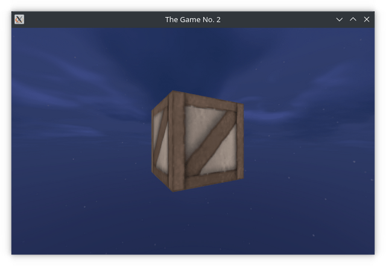

# The Game No. 2

[](https://github.com/thewizardplusplus/the-game-no-2/actions/workflows/lint.yaml)



## Running

Clone this repository:

```
$ git clone https://github.com/thewizardplusplus/the-game-no-2.git
$ cd the-game-no-2
```

Then run the game with the [LÖVR](https://lovr.org/) engine:

```
$ lovr .
```

See for details: <https://lovr.org/docs/Getting_Started>

## License

The MIT License (MIT)

Copyright &copy; 2026 thewizardplusplus
